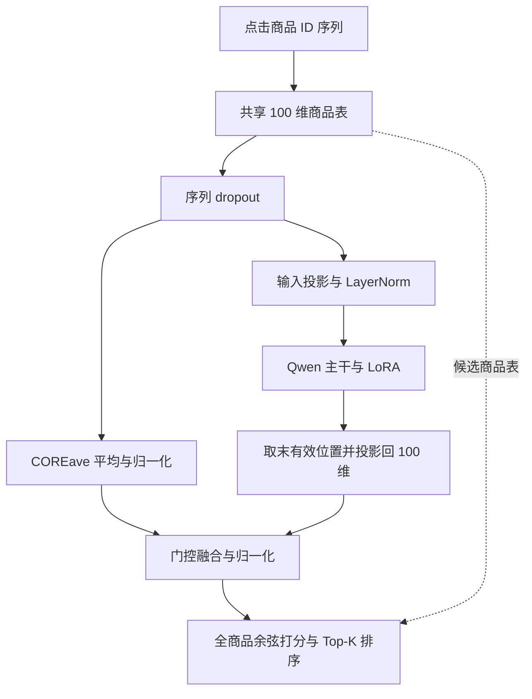

# CORE-LLM：模型说明与 Tmall 实验记录

_原始训练记录截至：2026-10-05；全量 LLM 训练日期：2026-10-02；统一入口 CORE 基线训练日期：2026-10-05；分组检查点复评日期：2026-10-09。时间均按北京时间（UTC+8）描述。2026-10-08 更新文件名称与入口，2026-10-09 将 review/explore 作为当前研究主线并完成三组全量验证复评；原始训练指标、日期和运行状态保持原样。_

模型代码为 `core_llm.py`，配置为 `configs/core_llm.yaml` 与 `configs/common.yaml`，训练入口为 `train.py` 或 IDE 可直接运行的 `train_llm.py`。当前默认 `model='llm'`、`variant='pretrained_lora'`、`smoke=False`、`test=False`，最多 30 轮、micro-batch 16、累积 16、学习率 0.001。操作细节见 [训练指南](README_TRAINING.md)。

```powershell
.\.venv\Scripts\python.exe train.py --model llm --variant pretrained_lora --smoke
.\.venv\Scripts\python.exe train.py --model llm --variant pretrained_lora
```

新增运行保存到 `results/core/`，终端打印 `CORE_RESULT_DIR` 和正常结束时的 `CORE_COMPLETE`。本文引用的 `results/phase1/` 是原始实验位置；保存配置中的历史名称不改写。可通过 `from train import load_experiment` 传入这些旧目录恢复模型，`core_*.py` 模块名和模型类名保持稳定。

## 🎯 当前研究主线：LLM 在哪一组有效

优先回答：LLM 是否改善 explore、却损害 review，还是两组都没有收益？整体 MRR 落后只能描述已观测整体结果，不能替代组内比较。

| 分组 | 依据真实下一商品的定义 |
| --- | --- |
| `review` | 真实目标出现在模型实际可见、排除 padding 的会话历史中 |
| `explore` | 真实目标没有出现在上述可见历史中 |

当前输入长度上限为 50，分组只看经过截断后传入模型的 `item_id_list`。目标仅在已截掉的历史中出现时，仍计为 `explore`。分组不由预测 Top-1 决定，也不表示商品在完整未截断会话、训练集或全局商品表中从未出现。两组共用原有全商品排序，只排除 padding，不按组过滤候选，不屏蔽历史商品。

2026-10-09 已在相同完整验证集上完成两组比例、AVE/TRM/LLM 组内 Recall/MRR 和 `LLM - 基线` 差值的首次比较，详细数据见下面的分组复评记录。当前观察是 explore 的微小改善与 review 的下降同时存在，后者主导整体损失。下一步按组诊断门控、两路会话表示与目标排名；随机主干、配对多 seed 和等预算调参继续用于判断预训练贡献和稳定性。原始运行没有保存分组指标，新证据来自独立检查点复评，并未回写原训练目录。

新训练在一次验证遍历中统计 `overall`、`review`、`explore`，默认报告样本数、比例以及 Recall/MRR@10/@20。空组指标为 `null`，非空两组按样本比例加权应复原未舍入的整体指标。逐轮结果写入 `epochs.json` 的 `valid_result` / `valid_review_explore`，最佳验证与测试分组写入 `metrics.json` 的 `best_valid_review_explore` / `test_review_explore`。`review_explore.json` 保存元数据、`valid` / `test` 及训练所选检查点的 `best_epoch`；推荐示例增加真实目标的 `target_group`。完整协议和命令见 [训练指南](README_TRAINING.md)。

---

## 📋 实验摘要

本实验考察：在只有点击商品 ID、没有商品名称、品牌和简介的条件下，能否将预训练语言模型作为连续向量输入的序列编码器，提升下一次点击预测效果。

当前实现为 **CORE + LLM 混合变体**：商品 ID 向量经过投影进入 Qwen3-0.6B-Base，得到会话表示，再与 COREave 分支进行门控融合，最终对全部商品打分。它不是让聊天模型通过文字回答一个商品 ID，也不是原始 CORE 的严格 RCE 编码器。

LLM 全量数据运行完成了 7 轮训练和验证，随后被中断；已观测最佳验证指标为 `MRR@20 = 0.1896`，对应 `epoch 1`（第 2 轮）。2026-10-05 新增的 COREave、COREtrm 全量基线均正常早停，各完成 8 轮，最佳验证 `MRR@20` 均为 `0.1936`，也对应 `epoch 1`。三组的数据文件和商品映射哈希、主要训练与评价协议已核对一致。

当前单 seed、主要协议对齐的验证比较中，LLM 的 MRR@20 低 `0.0040`，相对差约 `-2.07%`；其最佳检查点的 Recall@20 也低于两个基线。现阶段结论比此前更明确：当前配置未显示推荐质量优势，训练成本则明显更高。基线已经补齐，下一步应优先有限诊断和小范围调参，而不是继续补同一组基线或扩大模型。单 seed、LLM 中断、缺随机主干全量对照和新实验均未测试，仍限制最终结论。

> 📌 **记录边界：**本文区分“已执行实验”“已观测结果”和“后续建议”。`full` 表示使用全量数据，不代表训练已经正常结束。2026-10-08 的项目重构更新文件命名和入口说明，没有重跑本文实验或重新评估测试集。

## 🎯 实验思路与研究问题

### 为什么在纯 ID 场景引入 LLM

商品 ID 是类别标签，例如 `123` 与 `124` 的数字接近并不代表商品相似。因此，本实验不把这些编号当作自然语言数字，不使用 tokenizer、文本 prompt 或商品元信息，而是从头学习商品 embedding，再将连续向量输入 LLM。

需要检验的假设是：经过语言预训练的序列处理能力，能否通过少量可训练适配模块迁移到点击序列建模。该假设是实验目标，不是本次已经证实的事实。

阶段一依次回答三个问题：

1. **工程可行性：**纯 ID 输入能否完成训练、验证、保存和恢复推理？
2. **推荐价值：**在可比训练协议下，混合模型能否稳定优于 COREave、COREtrm？
3. **预训练价值：**在相同结构、LoRA 和可训练参数预算下，预训练主干能否优于随机冻结主干？

只有第 2、3 个问题都获得支持，才能将收益较有依据地归因于预训练迁移，并考虑进入下一阶段。仅仅 loss 下降或某次分数略高，不足以完成这个判断。

## ⚙️ 模型实现与预测方式

### 两个原始 CORE 基线

| 模型 | 会话表示的构造 | 候选商品打分 |
| --- | --- | --- |
| COREave | 对有效历史商品向量等权平均，再归一化 | 与归一化商品向量点积，除以温度 |
| COREtrm | 小型因果 Transformer 学习历史位置权重，加权求和后归一化 | 同 COREave |

COREtrm 的 Transformer 用于生成权重，最终表示仍是历史商品向量的加权和；这与直接把 Transformer 隐状态作为会话向量不同。实现来源：[COREave](D:/DataSciencePractise/CORE/core_ave.py)、[COREtrm](D:/DataSciencePractise/CORE/core_trm.py)。

### 本次 CORE + LLM 主模型



模型使用 `inputs_embeds` 接收投影后的商品向量；Qwen 原有语言词表的 embedding 不参与本次输入。Qwen 预训练本体冻结，但仍保留到输入投影的反向传播路径；训练商品表、输入/输出投影、LayerNorm、门控和 LoRA。没有加载旧 CORE 检查点，商品向量从头训练。

两路会话向量各自归一化后，使用可训练门控融合；门控初始值约为 `sigmoid(1) ≈ 0.73`，初始偏向 CORE 分支，但训练后的门控值尚未分析。最终共享 100 维推荐打分空间，不过投影和融合打破了原始 RCE 的严格加权和约束，因此不应称为“只替换 CORE 权重网络”。实现来源：[COREllm](D:/DataSciencePractise/CORE/core_llm.py)。

模型输出的是每个候选商品的排序分数，取分数最高的 Top-10/Top-20，再将内部编号映射回原始商品 ID。分数不是点击概率，也不要求模型输出自然语言解释。

### 输入输出投影与数据格式

设 B 为 batch 大小、S 为裁剪后的历史宽度、D=100 为商品维度，Qwen3-0.6B 的隐藏维度 H=1024：

| 位置 | 数据形状与类型 |
| --- | --- |
| 历史商品 ID | `int64 [B, S]`，0 为 padding |
| 商品 embedding | `float32 [B, S, 100]` |
| 输入 Linear + LayerNorm | `float32 [B, S, 1024]` |
| Qwen 输入 / 全部位置隐状态 | 默认 `bfloat16 [B, S, 1024]` |
| 每行最后有效位置 | `bfloat16 [B, 1024]` |
| 输出 Linear + 归一化 | `float32 [B, 100]` |
| CORE 分支与门控融合 | 会话向量 `[B, 100]`，门控 `[B, 1]` |
| 全商品分数 / 目标 / CE | `[B, V]` / `int64 [B]` / 标量 |

输入投影为 `Linear(100, 1024)` 后接 LayerNorm，输出投影为 `Linear(1024, 100)`。它们是可训练适配层，负责进入 Qwen 隐状态空间和返回共享商品打分空间；当前实现没有多层 MLP 的中间激活与第二个线性层。梯度从推荐交叉熵经过输出投影、Qwen 回到输入投影与商品表，冻结 Qwen 原始参数仍允许这条反向传播路径。

`COREllm` 继承 AVE 的全商品损失与排序方法，这些方法动态调用 LLM 的 `forward()`。模型取每行最后一个有效位置而非 padding 末列，再投影、门控融合，最终与共享商品表点积并除以温度。原始商品 token 经 RecBole 映射为内部 ID，Top-K 推荐再反映射为原始 token。

## 🧪 实验设计与当前执行情况

### 数据与评价协议

| 项目 | 本次设置 |
| --- | --- |
| 数据集 | 本地已处理的 Tmall 数据 |
| 输入 / 目标 | 历史 `item_id_list` / 下一次点击 `item_id` |
| 会话标识 | `session_id`，不是额外的用户画像特征 |
| 训练 / 验证 / 测试样本数 | 275,356 / 50,579 / 101,862 |
| 商品编号数 | 37,367，包含 padding ID 0 |
| 序列长度配置上限 | `MAX_ITEM_LIST_LENGTH = 50` |
| 切分方式 | 读取现有 train / valid / test 文件，不重新划分 |
| 训练目标 | 全商品交叉熵 CE，不进行训练负采样 |
| 评价候选集 | 全商品，排除 padding，允许推荐历史点击商品 |
| 指标 / 模型选择 | Recall、MRR @10/@20；按验证 MRR@20 选最佳检查点 |

虽然日志显示 `RS: [0.8, 0.1, 0.1]`，实际存在 `benchmark_filename: [train, valid, test]`，本次按给定文件切分；不能把实际样本比例写成新生成的 8:1:1。输入文件与商品映射的 SHA256 记录在 [manifest.json](D:/DataSciencePractise/CORE/results/phase1/20261002-132157-tmall-pretrained_lora-4d00c9/manifest.json)。评价允许重复点击，因此不额外屏蔽历史商品。训练 CE 中仍包含 padding 类，各模型一致；评价时才屏蔽 ID 0。

### 计划对照组与已完成范围

| 实验组 | 要回答的问题 | 当前已有记录 |
| --- | --- | --- |
| COREave | 简单平均基线是否足够 | 新统一入口全量已完成，8 轮正常早停；旧结果保留 |
| COREtrm | 小型 Transformer 加权基线效果 | 新统一入口全量已完成，8 轮正常早停；旧结果保留 |
| `pretrained_lora` | 预训练主干加 LoRA 的混合模型效果 | smoke 已完成；全量运行中断，已观测 7 轮 |
| `pretrained_frozen` | 不使用 LoRA、只训练适配模块的效果 | 仅 smoke |
| `random_lora` | 冻结主干的语言预训练是否有贡献 | 仅 smoke |

`random_lora` 保持 Qwen 架构、投影、门控和 LoRA 配置一致，主干随机初始化且冻结。它控制的是冻结预训练权重的贡献，不是从头完整训练大 Transformer。`tiny_random` 只用于工程检查，不是正式 Qwen 对照；`random_full` 虽有入口，但未执行，不建议在当前 8 GB GPU 上直接尝试全参数训练。

Smoke 使用训练 256 条、验证和测试各 128 条、1 个 epoch，保留全商品候选表。它验证管线能运行，不提供正式效果排名；部分 smoke 来自实现迭代中的不同版本，因此本文不将短跑分数合并成科学对照结果。

独立 CORE 模型不包含 LLM 或 LoRA。其运行选项中保留的 `variant=pretrained_lora`、`core_branch=ave`、`fusion=gate` 等是统一入口的无作用 LLM 选项；实际模型由 `model=ave/trm` 决定，不能据此将 COREtrm 写成 COREave 混合模型。

### 本次全量 LLM 的实际训练配置

| 项目 | 实际值 |
| --- | --- |
| 模型 / 分支 / 融合 | `pretrained_lora` / `ave` / `gate` |
| 主干 | `Qwen/Qwen3-0.6B-Base` |
| 固定 revision | `da87bfb608c14b7cf20ba1ce41287e8de496c0cd` |
| 商品维度 / 温度 | 100 / 0.07 |
| session / item dropout | 0.2 / 0.2 |
| LoRA | rank 8，alpha 16，dropout 0.05 |
| LoRA 位置 | `q_proj`、`k_proj`、`v_proj`、`o_proj` |
| 优化器 / 学习率 / weight decay | Adam / 0.001 / 0 |
| micro-batch / 累积 / 有效 batch | 16 / 16 / 256；尾部窗口按实际样本数处理 |
| 每 epoch 样本 / 参数更新 | 275,356 / 1,076 |
| 梯度裁剪 / 轮数上限 | 最大范数 5 / 30 |
| 验证频率 / 早停配置 | 每 epoch 验证 / `stopping_step = 5` |
| 配置 seed / 精度 | 2020 / Qwen 主干 BF16，商品表和投影等 FP32 |
| 省显存设置 / 测试开关 | gradient checkpointing 开启 / `test=False` |
| 总参数 / 可训练参数 | 602,288,553 / 6,238,633 |

当前 RecBole 实现使用 `cur_step > stopping_step` 判断停止，所以参数 5 实际对应连续 6 次验证指标严格低于最佳值才停止；持平也会重置计数。本次在 epoch 6 验证后连续下降计数为 5，尚未触发自动早停。配置依据：[本次 config.json](D:/DataSciencePractise/CORE/results/phase1/20261002-132157-tmall-pretrained_lora-4d00c9/config.json)、[梯度累积实现](D:/DataSciencePractise/CORE/trainer.py)、[早停源码](D:/DataSciencePractise/CORE/.venv/Lib/site-packages/recbole/utils/utils.py:113)。

## 📊 实验结果

### 全量 LLM 运行状态与最佳模型

本次运行编号为 `20261002-132157-tmall-pretrained_lora-4d00c9`，北京时间 2026-10-02 13:21:57 开始，20:26:18 被 `KeyboardInterrupt` 中断。epoch 0–6 的训练和验证已完成，下一轮训练未完成。运行状态是 `interrupted`，不是 `complete`，也不是 CUDA 不可用导致的 CPU 回退。状态依据：[metrics.json](D:/DataSciencePractise/CORE/results/phase1/20261002-132157-tmall-pretrained_lora-4d00c9/metrics.json)。

最佳检查点在 `epoch 1`（第 2 轮）保存，验证结果如下：

| 指标 | 值 | 如何理解 |
| --- | ---: | --- |
| Recall@10 | 0.3023 | 约 30.23% 的目标进入前 10 |
| Recall@20 | 0.3414 | 约 34.14% 的目标进入前 20 |
| MRR@10 | 0.1869 | 目标在前 10 时取排名倒数，否则记 0，再平均 |
| MRR@20 | 0.1896 | 目标在前 20 时取排名倒数，否则记 0，再平均 |

MRR 不是点击概率，也不能通过 `1 / MRR` 得到平均排名。这里只能说 epoch 1 是**已观测轮次中的最佳**，不能说它是所有可能训练轮次和配置中的最佳。

### 七轮验证指标

| epoch（从 0 开始） | Recall@10 | Recall@20 | MRR@10 | MRR@20 |
| ---: | ---: | ---: | ---: | ---: |
| 0 | 0.2789 | 0.3008 | 0.1848 | 0.1863 |
| 1 | 0.3023 | 0.3414 | 0.1869 | 0.1896 |
| 2 | 0.3063 | 0.3549 | 0.1853 | 0.1887 |
| 3 | 0.3062 | 0.3570 | 0.1833 | 0.1868 |
| 4 | 0.3021 | 0.3561 | 0.1800 | 0.1838 |
| 5 | 0.3034 | 0.3557 | 0.1801 | 0.1837 |
| 6 | 0.3019 | 0.3564 | 0.1789 | 0.1827 |

### Loss 与运行成本

| epoch | 训练平均 loss | 训练时间（秒） | 验证时间（秒） |
| ---: | ---: | ---: | ---: |
| 0 | 7.5562 | 3529.56 | 93.82 |
| 1 | 5.6141 | 3575.42 | 91.50 |
| 2 | 4.8520 | 3565.18 | 90.54 |
| 3 | 4.5001 | 3572.75 | 90.90 |
| 4 | 4.3093 | 3503.83 | 90.95 |
| 5 | 4.1865 | 3509.44 | 90.11 |
| 6 | 4.1041 | 3512.85 | 90.53 |

训练平均约 59 分钟/epoch，验证约 1.5 分钟/epoch，整个运行墙钟约 7 小时 4 分钟。一个 epoch 包含 1,076 次参数更新，不是“等一个小时才更新一次”。代码没有设定每轮等待一小时，当前 `show_progress=False` 使训练期间主要在轮次结束时输出日志。

本次设备为 NVIDIA GeForce RTX 4060；训练记录的峰值 `torch.cuda.max_memory_allocated` 约 1392 MiB。这是 PyTorch 已分配张量显存，不是全部进程占用、预留显存或显卡总利用率。环境为 Python 3.12.10、PyTorch 2.14.0+cu130、CUDA 13.0、RecBole 1.2.1、Transformers 4.57.6、PEFT 0.18.1、Accelerate 1.12.0、NumPy 1.26.4。

上述数字来自 [LLM 日志](D:/DataSciencePractise/CORE/log/COREllm/COREllm-tmall-Oct-02-2026_13-21-57-24fddf.log)、[epochs.json](D:/DataSciencePractise/CORE/results/phase1/20261002-132157-tmall-pretrained_lora-4d00c9/epochs.json)和 [manifest.json](D:/DataSciencePractise/CORE/results/phase1/20261002-132157-tmall-pretrained_lora-4d00c9/manifest.json)，不是基于截图估算的模型效果。

### 新增统一入口基线：主要验证对照

COREave 运行编号为 `20261005-115750-tmall-ave-9cf3dc`，北京时间 11:57:50–12:04:30；COREtrm 运行编号为 `20261005-120616-tmall-trm-32ec4d`，12:06:16–12:20:17。两组均为 `run_kind=full`、`status=complete`，完成 epoch 0–7 共 8 轮，并在 epoch 7 验证后正常早停。两组最佳检查点均在 epoch 1（第 2 轮），以下四个指标取自同一个按 MRR@20 选出的检查点，未分别挑选各指标的最高值。

| 模型及最佳 epoch | Recall@10 | Recall@20 | MRR@10 | MRR@20 |
| --- | ---: | ---: | ---: | ---: |
| 新 COREave，epoch 1 | 0.3082 | 0.3471 | 0.1909 | 0.1936 |
| 新 COREtrm，epoch 1 | 0.3079 | 0.3457 | 0.1910 | 0.1936 |
| LLM，已观测最佳 epoch 1 | 0.3023 | 0.3414 | 0.1869 | 0.1896 |

结果来源：[新 COREave metrics.json](D:/DataSciencePractise/CORE/results/phase1/20261005-115750-tmall-ave-9cf3dc/metrics.json)、[新 COREtrm metrics.json](D:/DataSciencePractise/CORE/results/phase1/20261005-120616-tmall-trm-32ec4d/metrics.json)和前述 LLM 日志。新基线的 `test_evaluated=false`、`test_result=null`；当前三组主要对照均没有全量测试结果，不能将旧 CORE 的测试分数填入新基线。

以“LLM 减去对应基线”计算描述性差值：

| 基线 | Recall@20 绝对差 | MRR@20 绝对差 | MRR@20 相对差 |
| --- | ---: | ---: | ---: |
| 新 COREave | -0.0057 | -0.0040 | -2.07% |
| 新 COREtrm | -0.0043 | -0.0040 | -2.07% |

相对差按 `(0.1896 - 0.1936) / 0.1936` 计算。当前 LLM 的四个报告指标均低于两个新基线；COREave 与 COREtrm 的 MRR@20 在四位小数精度下并列，不表示未舍入分数或模型本身完全相同。这些差值不是统计显著性结论。

为保留新增基线的训练轨迹，三组逐轮验证 MRR@20 记录如下：

| epoch | 新 COREave | 新 COREtrm | LLM |
| ---: | ---: | ---: | ---: |
| 0 | 0.1910 | 0.1914 | 0.1863 |
| 1 | 0.1936 | 0.1936 | 0.1896 |
| 2 | 0.1918 | 0.1924 | 0.1887 |
| 3 | 0.1907 | 0.1912 | 0.1868 |
| 4 | 0.1894 | 0.1900 | 0.1838 |
| 5 | 0.1889 | 0.1894 | 0.1837 |
| 6 | 0.1886 | 0.1890 | 0.1827 |
| 7 | 0.1889 | 0.1886 | —（未完成验证） |

共同已观测窗口 epoch 0–6 中，三组的最佳 MRR@20 都在 epoch 1；因此上述已观测差距并非来自为各组选择不同的最佳轮次。但 LLM 未完成 epoch 7 验证，仍不能将它标记为正常早停结束。新基线完整逐轮输出见 [COREave 日志](D:/DataSciencePractise/CORE/log/COREave/COREave-tmall-Oct-05-2026_11-57-50-c547fb.log)和 [COREtrm 日志](D:/DataSciencePractise/CORE/log/COREtrm/COREtrm-tmall-Oct-05-2026_12-06-16-3edd91.log)。

### 新基线与 LLM 的记录成本

| 模型 | 平均训练秒/epoch | 训练张量峰值（MiB） | 可训练参数 |
| --- | ---: | ---: | ---: |
| 新 COREave | 47.20 | 163.03 | 3,736,700 |
| 新 COREtrm | 100.91 | 179.80 | 3,926,713 |
| LLM | 3538.43 | 1392.32 | 6,238,633 |

平均耗时和峰值分别取每组 `epochs.json` 中已完成训练轮次的均值与最大值：CORE 各 8 轮、LLM 7 轮。新基线完整运行墙钟约为 COREave 6 分 40 秒、COREtrm 14 分 1 秒。三组设备均为同一型号 RTX 4060，主要训练设置一致，因此当前记录支持“LLM 成本高得多且未获质量收益”的筛选判断；但 IDE Run/Debug 模式、后台负载等未统一记录，不应将这些数据当作严格控制的速度基准测试，也未测推理延迟。

成本来源：[COREave epochs.json](D:/DataSciencePractise/CORE/results/phase1/20261005-115750-tmall-ave-9cf3dc/epochs.json)、[COREtrm epochs.json](D:/DataSciencePractise/CORE/results/phase1/20261005-120616-tmall-trm-32ec4d/epochs.json)和前述 LLM `epochs.json`。峰值仍指 PyTorch 已分配张量显存，不是全部进程占用。

### 旧 CORE 完整实验：仅作历史参考

下面保留 2026-09-30 旧入口完成的最佳验证结果，以及当时用于参考的 LLM 最佳验证结果。旧 CORE 使用 CPU、batch 2048、无梯度裁剪、轮数上限 300；不能把此表当作主要匹配对照。当前判断应优先使用上面的 2026-10-05 新基线。

| 模型 | Recall@10 | Recall@20 | MRR@10 | MRR@20 |
| --- | ---: | ---: | ---: | ---: |
| 旧 COREave，epoch 3 | 0.3059 | 0.3408 | 0.1916 | 0.1940 |
| 旧 COREtrm，epoch 4 | 0.3106 | 0.3507 | 0.1912 | 0.1940 |
| 本次 LLM，epoch 1 | 0.3023 | 0.3414 | 0.1869 | 0.1896 |

单看这些已观测值，LLM 的 MRR@20 比旧 CORE 低 `0.0044`，相对差约 `-2.27%`；Recall@20 与旧 COREave 接近、低于旧 COREtrm。这是描述性比较，不是显著性检验，也不能将差值全部归因于 LLM 或预训练。

旧 CORE 的测试结果单独记录如下，不能与上表中的 LLM 验证指标交叉比较：

| 模型 | 测试 Recall@10 | 测试 Recall@20 | 测试 MRR@10 | 测试 MRR@20 |
| --- | ---: | ---: | ---: | ---: |
| 旧 COREave | 0.4157 | 0.4445 | 0.3155 | 0.3175 |
| 旧 COREtrm | 0.4162 | 0.4498 | 0.3137 | 0.3160 |

LLM 与两组新基线的全量测试指标：**均未评估**。旧测试结果仅作历史保留。历史来源：[COREave 日志](D:/DataSciencePractise/CORE/log/COREave/COREave-tmall-Sep-30-2026_18-02-03-ed1b34.log:168)、[COREtrm 日志](D:/DataSciencePractise/CORE/log/COREtrm/COREtrm-tmall-Sep-30-2026_17-15-16-b904c9.log:209)。

## 📊 2026-10-09：已有最佳检查点的分组复评

对 2026-10-05 的 AVE/TRM 和 2026-10-02 的 LLM 最佳检查点进行了独立复评。三组均为 `best_epoch=1`、CUDA、评价 batch 32、`split=valid`、`scope=full`，完整覆盖同一组 50,579 条验证样本；没有重新训练或评估测试集。三组的 review 均为 17,633 条（34.8623%），explore 均为 32,946 条（65.1377%）。

| 模型 | review Recall@20 | review MRR@20 | explore Recall@20 | explore MRR@20 |
| --- | ---: | ---: | ---: | ---: |
| COREave | 0.781092 | 0.511378 | 0.114824 | 0.023582 |
| COREtrm | 0.779334 | 0.511815 | 0.113610 | 0.023324 |
| CORE + LLM | 0.762888 | 0.499573 | 0.115856 | 0.023754 |

表格保留六位小数，原始 JSON 保存未舍入均值和 @10/@20 指标。相对 AVE，LLM 的 review MRR@20 差值为 `-0.011804246`，explore 差值为 `+0.000171806`，整体差值为 `-0.004003320`。按样本比例加权，review 对整体差值的贡献为 `-0.004115231`，explore 为 `+0.000111911`：当前单 seed 验证中，explore 的微小改善不足以抵消 review 的下降。LLM 在 explore 上也略高于 TRM，但这不构成稳定、统计显著的收益或语言预训练贡献证明。

三组复评的整体指标经 RecBole 舍入后，均复现此前保存的整体结果。新评价状态为 `complete`，只表示检查点复评完成；LLM 原始训练仍为 `interrupted`，三组的全量测试仍未执行。原训练配置、指标、检查点和训练状态均未覆盖。

原始分组报告与复评状态文件：

- AVE：[review_explore.json](results/core/evaluation-20261009-112459-tmall-ebccc6/review_explore.json)、[metrics.json](results/core/evaluation-20261009-112459-tmall-ebccc6/metrics.json)
- TRM：[review_explore.json](results/core/evaluation-20261009-112630-tmall-d16aee/review_explore.json)、[metrics.json](results/core/evaluation-20261009-112630-tmall-d16aee/metrics.json)
- LLM：[review_explore.json](results/core/evaluation-20261009-112657-tmall-e1ee18/review_explore.json)、[metrics.json](results/core/evaluation-20261009-112657-tmall-e1ee18/metrics.json)

## 🔍 可比性与当前局限

### 新基线已解决的主要协议差异

| 核对项目 | 新 COREave / COREtrm 与 LLM 的共同设置 |
| --- | --- |
| 数据与商品映射 | train / valid / test 文件 SHA256、商品映射 SHA256 均相同 |
| 数据规模 | 275,356 / 50,579 / 101,862；商品数含 padding 为 37,367 |
| 入口 / trainer（现用名称） | `train.py` / `CORETrainer`，历史配置保留原名称 |
| micro-batch / 累积 / 有效 batch | 16 / 16 / 256 |
| 每轮参数更新 | 实际均为 1,076 次 |
| 优化器 / 学习率 / weight decay | Adam / 0.001 / 0 |
| 梯度裁剪 / 上限 | 最大范数 5 / 30 epochs |
| 验证 / 最佳选择 / 早停 | 每轮验证 / MRR@20 / 相同 `stopping_step=5` 实现 |
| 评价 batch / 候选集 | 32 / 全商品，排除 padding、允许历史商品 |
| 环境 / 设备 | 相同依赖版本 / RTX 4060、CUDA 13.0 |

数据字段、100 维共享推荐头、CE、温度 0.07、基础 dropout 0.2 也一致。这次新增实验已经解决旧比较中 batch、更新次数、裁剪、轮数上限、设备和数据文件是否相同的主要疑问，可以作为当前单 seed 的主要验证对照。核对依据：[新 COREave 配置](D:/DataSciencePractise/CORE/results/phase1/20261005-115750-tmall-ave-9cf3dc/config.json)、[新 COREtrm 配置](D:/DataSciencePractise/CORE/results/phase1/20261005-120616-tmall-trm-32ec4d/config.json)、两组对应 [COREave manifest](D:/DataSciencePractise/CORE/results/phase1/20261005-115750-tmall-ave-9cf3dc/manifest.json)、[COREtrm manifest](D:/DataSciencePractise/CORE/results/phase1/20261005-120616-tmall-trm-32ec4d/manifest.json)，以及 LLM 保存配置。

新三组的训练 loss 都按逐样本平均记录。旧日志的 batch mean 求和口径仍不同，只影响与旧结果的 loss 数值比较。新 CORE 实际采用 FP32；其配置里保留的 `llm_dtype=bfloat16` 对独立 CORE 无作用。LLM 主干使用 BF16，其余商品表、投影等采用 FP32，这是仍需明确记录的实现差别，不应因此否定已经对齐的主要验证协议。

### 随机性、数据追踪与归因

当前主要只有一个 seed，未报告多次重复的均值、标准差、置信区间或显著性检验。初始化还有待规范的细节：[COREllm 的局部种子块](D:/DataSciencePractise/CORE/core_llm.py:66)使用 `fork_rng(devices=[])`，只恢复 CPU 随机状态，但内部 `torch.manual_seed` 也会重设 CUDA 随机状态；最后的投影初始化可将 GPU 随机流留在 `llm_seed+1`。这是应修正的 RNG 隔离问题，不是已经证明的性能下降原因；预训练和随机 LoRA 两组都会经过相同的末尾种子块。

新三组的数据与商品映射哈希一致，已可核对数据内容相同；旧入口未保存哈希的限制仅适用于历史结果。仍需保留的限制是：LLM 中断而基线正常早停、新三组未评估测试集、未完整记录计时环境，以及没有多 seed 与等预算调参结果。

目前也没有全量 `random_lora` 对照，不能区分预训练、额外结构和投影/门控带来的影响。不同模型的参数量不必强行相等；但在预训练与随机主干的配对对照中，结构、适配方式、训练预算和初始化控制应保持一致。双方调参搜索预算也尚未统一。

## 💡 现阶段结论

### 已有证据支持什么

纯 ID 连续向量输入可以在当前 GPU 环境下完成多轮训练、全商品验证，并保存最佳模型；新 COREave 和 COREtrm 的全量基线也已正常完成。在数据内容与主要训练/评价协议对齐的单 seed 比较中，LLM 已观测最佳 MRR@20 为 0.1896，两个基线均为 0.1936；当前默认配置没有推荐质量优势。

三组均在 epoch 1 获得各自已观测最佳 MRR@20，之后 loss 继续下降但 MRR 回退。因此“loss 下降、验证排序质量下降”的现象不只出现在 LLM，不能视为 LLM 特有缺陷或预训练无效的证据。它可能反映过拟合或训练目标与排序指标的权衡，具体原因仍待诊断。LLM 的 Recall@20 已观测最高值在 epoch 3，为 0.3570；主指标仍为 MRR@20，不能为提高表面成绩临时改成按 Recall 选模型。

### 现有证据不支持什么

当前主要协议对齐的比较未观察到 LLM 优势，但不能证明“LLM 对纯 ID 推荐无效”。也不能证明语言预训练有帮助、模型已经达到全局最佳、增加轮数一定会改善结果，或观察到的差值具有统计显著性。单数据集、单 seed、LLM 未正常结束、随机主干对照不足和未评估测试，仍不支持泛化到其他配置或场景。

### 是否值得继续

作为筛选研究方向的阶段一实验，它仍有价值：不仅验证了工程可行性，也通过补齐基线排除了此前若干主要协议混杂，提供了“当前配置未获得推荐收益”的初步结果。作为目前可直接替代 CORE 的推荐方案，证据不足；没有观察到能够支撑约一小时/轮成本的推荐收益。当前 COREave 与 COREtrm 的 MRR@20 在报告精度下并列，而 COREave 更简单且记录训练耗时更低，可以优先作为后续诊断的参照基线。

首次全量 review/explore 检查点比较已完成，当前单 seed 的 explore 略有改善、review 明显下降。下一步按组分析门控、分支表示与排序，检验是否存在可重复的两组权衡，再开展有限调参与对照。不再把“补齐单 seed CORE 基线”或“首次分组复评”作为未完成任务。暂不升级更大的 LLM、不引入商品文本来改变本次纯 ID 问题，也不直接进入复杂的下一阶段。

## 🔄 是否调整与后续实验建议

### 优先级一：分组比较已完成，诊断门控与两路表示

三组已有最佳检查点在相同完整验证集上的首次分组复评已完成，当前属于“explore 微小改善、review 退步使整体下降”的观测情况。后续重点是按组分析门控分布、CORE/LLM 会话表示和真实目标排名，检验 review 损失集中在哪些样本，以及 explore 微小优势是否来自融合或分支排序；这些解释仍待验证，不能把一次分组差值当作因果结论。

不能把模型推荐的 Top-1 是否属于历史商品当作本协议的分组标签，也不能把 explore 改为全局新商品或全会话未见商品。改变候选集或屏蔽历史商品会改变任务，应与本次完整商品排名诊断分开记录。

正式重复前先规范 CPU/CUDA 随机状态隔离，记录代码版本和数据哈希；这项修正尚未在本次文档工作中执行。已有 LLM 结果保留为原协议下的探索记录，不应悄悄改写其配置或状态。

本轮 COREave 与 COREtrm 已按 micro-batch 16、累积 16、有效 batch 256、梯度裁剪 5、上限 30 epochs、每轮验证、同一早停实现、Adam 学习率 0.001 和相同全量数据完成，无需再重复补这两组来解决 batch 差异。后续继续保持这些主要协议；统一 micro-batch 和累积方式比只统一名义有效 batch 更清楚，因为 dropout 的随机实现不保证与单个大 batch 数值等价。

完成分组基线比较后，利用已保存检查点按 review/explore 分别分析门控、两路表示和目标排序，定位哪一组受益或受损；这些诊断尚未形成本文的实验结论。若决定进行正式多 seed 重复或最终报告，规范随机性后的配对重复应包含 LLM，已有中断记录不能改标为完整重复。以准确率为目的的公平比较不要求两种架构所有层都采用 BF16，但精度必须明确；效率测量应统一设备、Run/Debug 模式和计时口径。

### 优先级二：根据公平比较决定是否调参

当前默认配置已在主要协议对齐的整体比较中落后，后续搜索应同时追踪 review/explore，避免只看整体分数。如果分组诊断提示优化设置可能限制某组效果，可进行小范围学习率搜索，例如 `0.001`、`0.0003`、`0.0001`；这是建议，不是已执行实验，也不预设较小学习率一定更好。CORE 与 LLM 应获得可比的配置搜索预算，不能只替 LLM 调参；先约定有限预算和停止条件，避免无休止地追分。

必要时可分析门控值、做 CORE-only/LLM-only 推理消融，或使用已有 `--fusion llm_only` 重新训练。联合训练检查点中的 CORE 分支不是独立训练的 CORE 基线；推理消融也不能替代从头训练的结构对照。不建议仅为追分延长训练或放宽早停。

### 优先级三：确认增益来源和稳定性

若匹配实验显示稳定的改进信号，优先补全量 `random_lora`，随后考虑 `pretrained_frozen`，判断预训练和 LoRA 各自的贡献。再在 `2020`、`2021`、`2022` 等配对 seeds 上复核，报告均值与波动。最后固定方案，在同一全量测试集上评估各组的最佳验证检查点，测试集不用于挑选超参数。

| 后续观察 | 对应决策 |
| --- | --- |
| explore 改善，但 review 损失使整体下降 | 先按组检查门控与分支排序，验证收益和代价是否稳定 |
| review / explore 均无改善 | 先确认协议和基线，再据有限诊断与对照结果收缩投入 |
| 稳定优于 CORE，也优于匹配的随机主干 | 有依据继续研究预训练迁移，并结合成本决定是否进入下一阶段 |
| 优于 CORE，但不优于随机主干 | 可能是额外结构的收益，不能归因于语言预训练 |
| 公平调参和重复后仍无稳定增益 | 记录为该配置与场景下未获收益，收缩投入，不直接换更大模型 |
| 增益很小但耗时明显增加 | 从效率和研究目标判断是否值得继续，不能只看单个分数 |

当前不设一个任意的“MRR 必须达到 0.20”门槛。是否继续，应以匹配基线的稳定增益、随机主干对照和计算成本共同判断。

## 💾 结果位置与后续运行方式

### LLM 原始运行保存的文件

结果目录：[本次全量 LLM 目录](D:/DataSciencePractise/CORE/results/phase1/20261002-132157-tmall-pretrained_lora-4d00c9)。

| 文件 | 用途与当前情况 |
| --- | --- |
| [metrics.json](D:/DataSciencePractise/CORE/results/phase1/20261002-132157-tmall-pretrained_lora-4d00c9/metrics.json) | 状态、运行选项和中断信息；没有正常完成后的最佳结果汇总 |
| [epochs.json](D:/DataSciencePractise/CORE/results/phase1/20261002-132157-tmall-pretrained_lora-4d00c9/epochs.json) | 七轮平均 loss、更新次数、训练耗时、张量峰值显存 |
| [config.json](D:/DataSciencePractise/CORE/results/phase1/20261002-132157-tmall-pretrained_lora-4d00c9/config.json) | 本次实际合并配置，不以当前默认配置代替历史配置 |
| [manifest.json](D:/DataSciencePractise/CORE/results/phase1/20261002-132157-tmall-pretrained_lora-4d00c9/manifest.json) | 环境、硬件、参数量、样本数、模型版本及数据哈希 |
| [best.pth](D:/DataSciencePractise/CORE/results/phase1/20261002-132157-tmall-pretrained_lora-4d00c9/best.pth) | 已观测最佳 epoch 1 检查点；不是中断前最新训练状态 |
| [item_tokens.json](D:/DataSciencePractise/CORE/results/phase1/20261002-132157-tmall-pretrained_lora-4d00c9/item_tokens.json) | 内部商品编号到原始 ID 的映射 |
| [完整训练日志](D:/DataSciencePractise/CORE/log/COREllm/COREllm-tmall-Oct-02-2026_13-21-57-24fddf.log) | 七轮全部验证指标与最佳模型保存记录 |

由于运行中断，本次目录尚未生成正常结束流程中的 `predictions.json`，`metrics.json` 也未填入 `best_valid_result`；因此本文最佳验证指标取自训练日志。恢复推理可使用入口中的 `load_experiment`，并保留固定版本的模型缓存、数据文件和 ID 映射；只加载本项目可信的检查点。

当前入口不提供自动断点续训。再次点击 Run 会创建新目录并从头训练；恢复模型用于预测，不等于恢复优化器和中断时的训练进度。也不需要为保存已有最佳模型而强行跑满 30 轮。

### 新增基线结果位置

| 基线 | 运行目录与状态 | 主结果与逐轮记录 |
| --- | --- | --- |
| COREave | [20261005-115750-tmall-ave-9cf3dc](D:/DataSciencePractise/CORE/results/phase1/20261005-115750-tmall-ave-9cf3dc)，`complete` | [metrics.json](D:/DataSciencePractise/CORE/results/phase1/20261005-115750-tmall-ave-9cf3dc/metrics.json)、[epochs.json](D:/DataSciencePractise/CORE/results/phase1/20261005-115750-tmall-ave-9cf3dc/epochs.json) |
| COREtrm | [20261005-120616-tmall-trm-32ec4d](D:/DataSciencePractise/CORE/results/phase1/20261005-120616-tmall-trm-32ec4d)，`complete` | [metrics.json](D:/DataSciencePractise/CORE/results/phase1/20261005-120616-tmall-trm-32ec4d/metrics.json)、[epochs.json](D:/DataSciencePractise/CORE/results/phase1/20261005-120616-tmall-trm-32ec4d/epochs.json) |

两组目录均包含 `best.pth`、`config.json`、`manifest.json`、`item_tokens.json` 和 `predictions.json`。这些 `predictions.json` 是最佳检查点在验证集上抽取的 5 条示例，不是全量测试结果；`prediction_split=valid`。可用于学习查看推荐 ID，但不能用这几条示例判断整体效果。

### 后续命令示例：只记录，不自动执行

以下命令用于复现 2026-10-09 已完成的三组全量验证分组复评；它们不启动训练，再次执行会产生新的独立评价目录：

```powershell
.\.venv\Scripts\python.exe evaluate.py --run-directory results/phase1/20261005-115750-tmall-ave-9cf3dc --split valid --device cuda --eval-batch-size 32
.\.venv\Scripts\python.exe evaluate.py --run-directory results/phase1/20261005-120616-tmall-trm-32ec4d --split valid --device cuda --eval-batch-size 32
.\.venv\Scripts\python.exe evaluate.py --run-directory results/phase1/20261002-132157-tmall-pretrained_lora-4d00c9 --split valid --device cuda --eval-batch-size 32
```

每次复评在新的 `results/core/evaluation-.../` 中保存 `review_explore.json` 与 `metrics.json`，记录实际检查点轮次 `best_epoch` 和检查点 SHA256，不覆盖原始训练记录。默认 split 是 `valid`；方案固定后显式指定 `--split test` 才进行测试。需要检查流程时可加 `--limit 128`，其结果明确标为 `prefix_subset`，只描述验证集前缀子集，不能视为全量效果；新训练 smoke 的范围标为 `smoke_subset`。

完成分组诊断、决定继续有限学习率搜索后，可使用下面的 LLM 新训练示例；正式重复前先处理前述随机性问题。每次只运行一条，不与现有任务同时争用同一张 GPU：

```powershell
& "D:\DataSciencePractise\CORE\.venv\Scripts\python.exe" "D:\DataSciencePractise\CORE\train.py" --model llm --variant pretrained_lora --dataset tmall --epochs 30 --micro-batch-size 16 --accumulation-steps 16 --learning-rate 0.0003 --seed 2020
```

若需要配对 seed 或学习率重复，独立基线使用 `--model ave` 或 `--model trm`；随机主干对照使用 `--model llm --variant random_lora`。正式组不要加 `--smoke`；最终方案固定后才使用 `--test`。这些命令会启动新的训练，不会接着本次检查点继续；本文更新时没有执行它们。

也可以在 PyCharm 使用项目解释器 `D:\DataSciencePractise\CORE\.venv\Scripts\python.exe`，打开 [train_llm.py](D:/DataSciencePractise/CORE/train_llm.py) 调用 `run_experiment(...)`，不要求每次在终端输入命令。该入口固定 `model='llm'`、`variant='pretrained_lora'`，默认 `smoke=False`、`test=False`；点击 Run 会启动一组新的全量 LLM 训练。小数据检查应先改为 `smoke=True`，独立 AVE/TRM 使用各自的 `train_ave.py`、`train_trm.py`。

更完整的运行说明见 [训练指南](D:/DataSciencePractise/CORE/README_TRAINING.md)。当前入口与指南描述新的运行方式；历史实验协议以对应目录中的 `config.json` 为准。

## 🔗 证据索引与记录原则

本文结果仅来自本地实验记录，不将项目原 README 的其他数据集示例或论文数值当作本次结果。核心证据为 LLM 原始运行及 2026-10-05 两组新基线的日志、`config.json`、`manifest.json`、`epochs.json`、状态文件；两条旧 CORE 完整日志仅作历史保留，模型解释依据当前源码。

2026-10-05 的记录更新新增了两组完整基线及其逐轮 MRR、成本和数据哈希核对，删除了“新基线仅 smoke”“主要欠全量 CORE 基线”的过期判断，将后续重点改为有限诊断、等预算调参及必要的配对重复。2026-10-08 更新当前命名和操作说明；2026-10-09 新增 review/explore 定义、评价操作和三组已有检查点的全量验证复评结果。LLM 原始七轮记录、旧 CORE 结果和未测试状态均保留，新证据单独保存，没有覆盖任何原实验产物。

后续有新实验时，应新增运行记录并说明协议变化，不覆盖或把本次中断状态改成完成。至少记录运行编号、模型/变体、seed、数据哈希、micro-batch/累积、学习率、裁剪、轮数上限、早停实现、设备/精度、最佳验证轮次、测试是否评估、训练与推理成本、代码版本，以及均值和波动（如已重复）。

已有阶段性结论是：纯 ID 的 CORE + LLM 适配在工程上可行；补齐主要协议一致的全量 CORE 基线后，当前单 seed 默认配置的整体验证质量仍落后，且记录训练成本更高。首次分组复评进一步显示 explore 略有改善，但 review 下降主导整体损失。当前主线转向按组诊断门控与分支，随后用随机主干、等预算调参和配对重复检验归因与稳定性；微小 explore 优势尚不能证明稳定收益或语言预训练价值。
